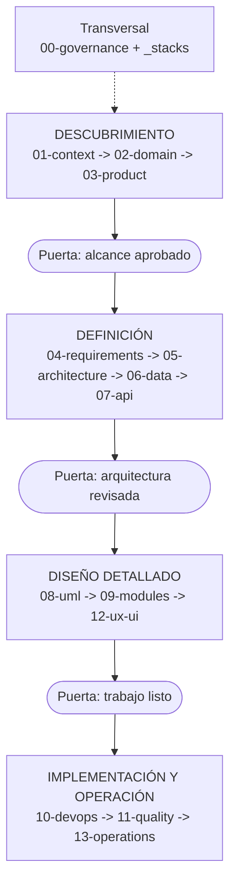

# Guía SDD — Software Design Documentation

> [!NOTE] INSTRUCTIONS
> Este es el punto de entrada del repositorio y está exento del límite de 80 líneas.
> Mantenga este bloque hasta que una segunda persona confirme fases, puertas y responsables.

## ¿Qué es SDD?

SDD exige diseñar y revisar antes de implementar. El documento guía el cambio; después se actualiza con la evidencia real.

```text
Flujo reactivo: Código -> documentación eventual
Flujo SDD:      Documento revisado -> código -> documento y evidencia actualizados
```

### Los tres principios SDD

1. **Diseño antes de código.** Una decisión no existe hasta quedar escrita y revisada.
2. **Documentación viva.** Código y documento cambian en el mismo Pull Request.
3. **Trazabilidad.** Necesidad, requisito, historia, decisión, componente, prueba y evidencia permanecen enlazados.

## Las cuatro fases



AlertaMujer no es un único desplegable. La metodología se conserva, pero cada puerta verifica los tres ecosistemas y sus contratos sin mezclar responsabilidades.

## Orden de llenado recomendado

| Orden | Ruta | Pregunta |
|---|---|---|
| 1 | `00-governance/` | ¿Cómo trabaja y decide el equipo? |
| 2 | `01-context/` | ¿Qué se construye y para quién? |
| 3 | `02-domain/` | ¿Qué entidades y reglas gobiernan el sistema? |
| 4 | `03-product/` | ¿Qué resultado funcional se persigue? |
| 5 | `04-requirements/` | ¿Qué debe cumplir cada ecosistema? |
| 6 | `05-architecture/` | ¿Cómo se distribuyen responsabilidades? |
| 7 | `06-data/` | ¿Qué persiste PostgreSQL y cómo evoluciona? |
| 8 | `07-api/` | ¿Qué contratos coordinan clientes y servidor? |
| 9 | `08-uml/` | ¿Qué estructuras y flujos deben visualizarse? |
| 10 | `09-modules/` | ¿Qué posee, expone y opera cada módulo? |
| 11 | `12-ux-ui/` | ¿Qué estados y reglas mantienen coherencia visual? |
| 12 | `10-devops/`, `11-quality/`, `13-operations/` | ¿Cómo se prepara, prueba, ejecuta y recupera? |

## Puertas de revisión

| Puerta | Después de | Aprobador | Evidencia mínima |
|---|---|---|---|
| Alcance | `03-product/` | Producto y responsables técnicos | alcance, actores, exclusiones y reglas |
| Arquitectura | `07-api/` | Responsables Frontend, Backend y Database | ADR, modelo y contratos compatibles |
| Trabajo listo | `12-ux-ui/` | Producto y equipo ejecutor | historia Ready, diseño y pruebas esperadas |
| Go / No-Go | Antes de desplegar | Responsables técnico y funcional | DoD, rollback y evidencia por ecosistema |

## Regla de documentación viva

```text
Si cambia el comportamiento y no cambia su fuente principal -> el documento queda incorrecto
Si un documento declara implementación sin evidencia         -> el documento queda incorrecto
```

La persona que abre el cambio actualiza la fuente principal, sus enlaces y la matriz de trazabilidad. No se difiere la corrección a otro Pull Request.

---

**Relacionados:** [`00-governance/README.md`](./00-governance/README.md) · [`00-governance/documentation-rules.md`](./00-governance/documentation-rules.md)
