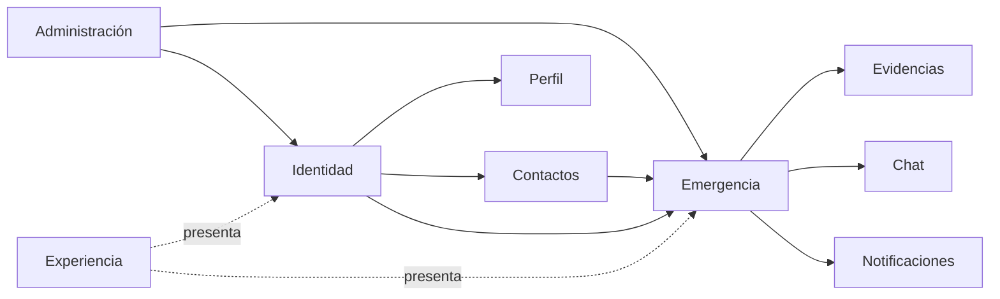

# 02 — Mapa de Dominio

> [!NOTE] INSTRUCTIONS
> El mapa usa capacidades, no repositorios. Mantenga el bloque hasta validar relaciones y lenguaje con requisitos.

## Contextos funcionales

| Contexto | Responsabilidad | Datos principales | Ecosistemas |
|---|---|---|---|
| Identidad | Registro, cuenta, credenciales, OTP y sesión | solicitudes, usuarios, códigos, sesiones | Frontend / Backend / Database |
| Perfil | Datos editables y configuración SOS | perfil, mensaje de ayuda | Frontend / Backend / Database |
| Contactos | Invitaciones y relaciones aceptadas | contactos | Frontend / Backend / Database |
| Emergencia | SOS, estados, ubicación y cierre | emergencia, historial, ubicaciones | Todos |
| Evidencias | Captura, archivo y metadatos | fotografías y referencias | Todos |
| Chat | Mensajes asociados a emergencia | mensajes | Frontend / Backend / Database |
| Notificaciones | Tokens e intentos FCM | dispositivos e intentos | Backend / Database / Mobile |
| Administración | Atención, cuentas y auditoría | eventos administrativos | Web / Backend / Database |
| Experiencia | Idiomas, tema, navegación y accesibilidad | preferencias locales | Frontend |

## Leyenda de relaciones

## Cómo se usa el mapa

Requisitos identifican contexto; arquitectura asigna módulo y ecosistema; datos asigna tablas; API define cruces; pruebas validan la relación sin duplicar reglas.

---

**Relacionados:** [`./entities-and-rules.md`](./entities-and-rules.md) · [`./module-boundaries.md`](./module-boundaries.md)
