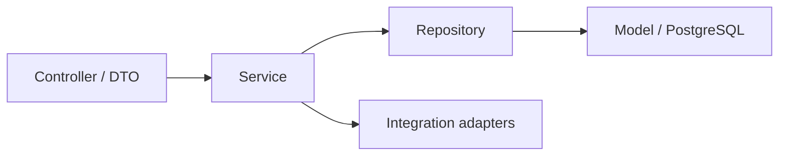

# 05 — Arquitectura por Capas

> [!NOTE] INSTRUCTIONS
> Las capas pertenecen al Backend. Ajuste nombres solo mediante ADR y mantenga la dirección de dependencia.

## Las cuatro capas

| Capa | Responsabilidad | No hace |
|---|---|---|
| `controller` + DTO | HTTP/WSS, validación de forma y mapeo | reglas, SQL, archivos directos |
| `service` | casos de uso, autorización, transacciones y estados | detalles HTTP o consultas dispersas |
| `repository` | consultas y persistencia mediante rol app | reglas de negocio |
| `model` | representación persistente controlada | generación de esquema |

Integraciones FCM, archivos y WSS permanecen en adaptadores del módulo que las usa; no se convierten en capas globales con lógica de negocio.

## Dirección de dependencia

- Controller depende de Service.
- Service define reglas y consume repositorios/adaptadores mediante interfaces.
- Repository no llama Controller ni decide autorización.
- Model no ejecuta Liquibase ni reemplaza el modelo Database.

## Cuándo las capas no bastan

Si Identity, Emergency o Administration comparten paquetes internos, nombres o transacciones sin contrato, se necesita reforzar módulo, no añadir otra capa genérica.

## Evolución

1. Crear esqueleto modular con Identity.
2. Implementar vertical de sesión y pruebas.
3. Añadir Contacts y Emergency respetando interfaces.
4. Integrar FCM, archivos y WSS solo tras contratos.

---

**Relacionados:** [`./modular-monolith.md`](./modular-monolith.md) · [`./module-structure.md`](./module-structure.md)
