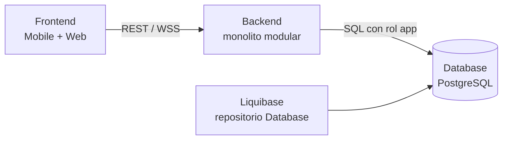

# 05 — Monolito Modular Backend

> [!NOTE] INSTRUCTIONS
> La decisión aplica al Backend objetivo, no al conjunto de repositorios. Mantenga el bloque mientras no exista implementación verificable.

## Qué es

Una aplicación Spring Boot desplegable como unidad y dividida internamente por capacidades. Cada módulo ofrece servicios controlados y mantiene sus detalles internos fuera del alcance de otros módulos.

## Tres ecosistemas, un Backend monolítico

Frontend y Database no son módulos internos del monolito: son repositorios independientes. Solo Backend comparte proceso, transacciones y release entre sus módulos.

## Módulos Backend objetivo

| Módulo | Responsabilidad | Depende de |
|---|---|---|
| Identity | registro, OTP, JWT, sesión y cuenta | configuración |
| Profile | perfil y configuración SOS | Identity |
| Contacts | directorio e invitaciones | Identity |
| Emergency | SOS, estados y ubicación | Identity, Contacts |
| Notification | tokens e intentos FCM | Emergency, Contacts |
| Evidence | archivos y metadata autorizada | Emergency |
| Chat | REST histórico y WSS/STOMP | Emergency, Identity |
| Administration | atención, cuentas y auditoría | módulos anteriores |

## Comunicación interna

Los servicios llaman interfaces públicas dentro del mismo proceso y transacción cuando aplica. No existen broker, API gateway, service discovery o consistencia eventual entre módulos.

## Cuándo aplica

Aplica porque las reglas de SOS, identidad y eliminación necesitan transacciones coherentes y el alcance no justifica distribución. Estado: aceptado como diseño; implementación Backend pendiente.

---

**Relacionados:** [`../02-domain/module-boundaries.md`](../02-domain/module-boundaries.md) · [`./boundary-enforcement.md`](./boundary-enforcement.md)
