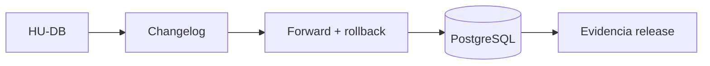

# 06 — Datos

> [!NOTE] INSTRUCTIONS
> Esta sección explica propiedad y evolución de datos. El SQL ejecutable vive únicamente en Database.

## Propósito

Describir el modelo persistente confirmado, sus convenciones y el proceso que lo modifica sin duplicar los changelogs.

## Documentos

| Documento | Pregunta que responde | Fuente principal |
|---|---|---|
| [`models.md`](models.md) | ¿Qué entidades existen y quién las posee? | Modelo Database |
| [`database-conventions.md`](database-conventions.md) | ¿Qué reglas físicas se aplican? | SQL vigente |
| [`migrations.md`](migrations.md) | ¿Cómo evoluciona el esquema? | Liquibase |

## Autoridad

El repositorio Database es la autoridad física. Esta sección resume su intención y enlaza la fuente técnica.

## Fuera de alcance

- DDL duplicado.
- Consultas del Backend.
- Estado local del Frontend.
- Decisiones no reflejadas en el repositorio Database.

## Listo cuando

- Las 16 entidades confirmadas tienen propietario y propósito.
- Cada convención enlaza evidencia implementada.
- El proceso de migración conserva avance, rollback y validación.

---

**Relacionados:** [`../02-domain/entities-and-rules.md`](../02-domain/entities-and-rules.md) · [`../09-modules/database/README.md`](../09-modules/database/README.md)
