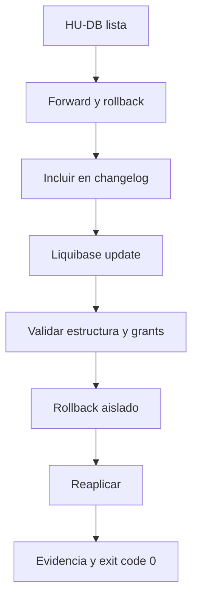

# 06 — Migraciones

> [!NOTE] INSTRUCTIONS
> Use el comando vigente del repositorio Database; no agregue una segunda puerta de calidad en esta documentación.

## Unidad de cambio

Una HU-DB agrupa el cambio de esquema necesario para una capacidad verificable. Conserva SQL de avance y rollback separados y su inclusión ordenada en el changelog.

## Flujo



## Validación oficial

Desde el repositorio Database:

```powershell
powershell -NoProfile -ExecutionPolicy Bypass -File .\scripts\test-release.ps1 -ReleaseTag <tag>
```

La ejecución solo es exitosa cuando termina con código `0` y el mensaje final de release aprobado. Una salida parcial no constituye evidencia suficiente.

## Rollback

- Limpiar fixtures dependientes antes de revertir una entidad padre.
- Usar `rollback-count` únicamente cuando los changesets de la historia sean globalmente contiguos.
- Confirmar que la reaplicación reproduce el estado esperado.
- No modificar checksums de cambios ya aplicados.

## Responsabilidades

| Actor | Responsabilidad |
|---|---|
| Database | changeSets, SQL, rollback, grants y prueba |
| Backend | compatibilidad del acceso tras el cambio |
| Revisor | evidencia completa y alcance de la HU |

---

**Relacionados:** [`../05-architecture/decisions/records/ADR-003-postgresql-liquibase.md`](../05-architecture/decisions/records/ADR-003-postgresql-liquibase.md) · [`../11-quality/testing-strategy.md`](../11-quality/testing-strategy.md)
