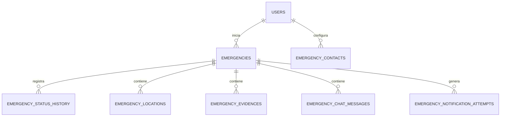

# 06 — Modelo de datos

> [!NOTE] INSTRUCTIONS
> Actualice el catálogo solo después de verificar el changelog vigente. No convierta una entidad objetivo en implementada.

## Resumen verificado

El modelo físico confirmado contiene 16 entidades distribuidas en siete esquemas PostgreSQL. La historia HU-DB-025 ya está aplicada y no se clasifica en refinamiento.

| Esquema | Entidad | Responsabilidad |
|---|---|---|
| `configuration` | `system_configuration` | parámetros operativos globales |
| `identity` | `registration_requests` | registro previo y verificación |
| `identity` | `users` | cuentas y estado funcional |
| `identity` | `user_credentials` | credencial protegida por cuenta |
| `identity` | `user_verification_codes` | códigos OTP temporales |
| `identity` | `user_sessions` | sesiones renovables y revocables |
| `profile` | `user_emergency_settings` | mensaje SOS personalizado |
| `contacts` | `emergency_contacts` | vínculo consentido entre cuentas |
| `notification` | `user_device_tokens` | tokens FCM por cuenta y dispositivo |
| `emergency` | `emergencies` | agregado y estado SOS |
| `emergency` | `emergency_status_history` | transición auditable de estados |
| `emergency` | `emergency_locations` | ubicaciones confirmadas |
| `emergency` | `emergency_evidences` | metadata de fotografías |
| `emergency` | `emergency_chat_messages` | mensajes asociados al evento |
| `notification` | `emergency_notification_attempts` | resultado del intento FCM |
| `audit` | `audit_logs` | acciones administrativas y de seguridad |

## Relaciones centrales

## Propiedad

Database posee estructura, constraints, índices y privilegios. Backend será responsable de reglas de aplicación; Frontend no accede directamente a PostgreSQL.

## Pendientes controlados

- Retención temporal por tipo de dato: **Pendiente**.
- Clasificación formal de sensibilidad por columna: **En refinamiento**.
- Estrategia de archivo físico de evidencias: **Pendiente**.

---

**Relacionados:** [`./database-conventions.md`](./database-conventions.md) · [`../04-requirements/database-stories.md`](../04-requirements/database-stories.md)
