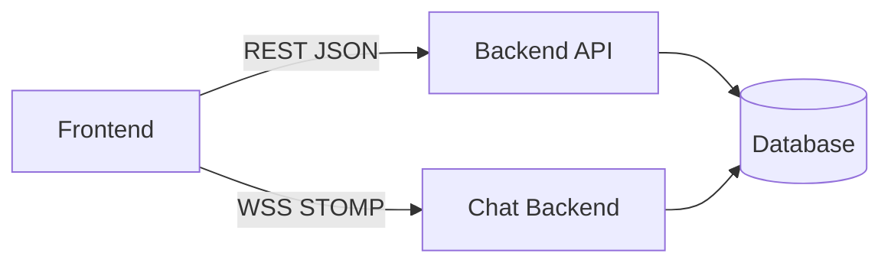

# 07 — API y contratos

> [!NOTE] INSTRUCTIONS
> Mantenga los contratos alineados con Backend real. El scaffold Backend no expone endpoints; el archivo OpenAPI actual expresa diseño y estados pendientes.

## Propósito

Definir cómo Frontend consume capacidades Backend y cómo se gobiernan los contratos REST y WSS/STOMP.

## Documentos

| Documento | Pregunta que responde | Estado |
|---|---|---|
| [`rest-conventions.md`](rest-conventions.md) | ¿Cómo se diseñan endpoints y errores? | Vigente como diseño |
| [`wss-stomp.md`](wss-stomp.md) | ¿Cómo funciona el canal de chat? | Vigente como diseño |
| [`contracts/openapi/openapi-alertamujer-v1.yaml`](contracts/openapi/openapi-alertamujer-v1.yaml) | ¿Cuál es el contrato aprobado? | Vigente como diseño |
| [`contracts/openapi/_template-api.yaml`](contracts/openapi/_template-api.yaml) | ¿Cómo se inicia un contrato nuevo? | Plantilla |

## Autoridad

El contrato aceptado y el código Backend implementado deben coincidir. Mientras el scaffold no tenga controladores ni pruebas contractuales, los endpoints permanecen como objetivo documental.

## Dependencias

## Fuera de alcance

- Componentes visuales.
- Tablas y SQL.
- Credenciales o secretos.
- Contratos de proveedores no confirmados.

## Listo cuando

- Operaciones, errores, seguridad y ejemplos son coherentes.
- Cada operación se traza a un requisito o historia.
- La implementación Backend y las pruebas contractuales coinciden.

---

**Relacionados:** [`../05-architecture/integrations.md`](../05-architecture/integrations.md) · [`../09-modules/backend/README.md`](../09-modules/backend/README.md)
