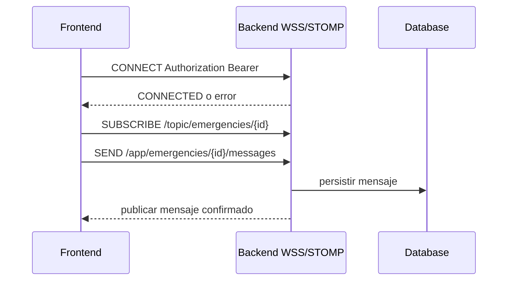

# 07 — WSS y STOMP

> [!NOTE] INSTRUCTIONS
> Estado: vigente como diseño. Backend no ofrece todavía evidencia de implementación.

## Propósito

Definir chat y actualizaciones de estado de una emergencia. REST crea SOS y recupera alertas y mensajes persistidos.

## Canal objetivo

## Conexión y destinos

| Elemento | Definición |
|---|---|
| Transporte | `wss://<host>/ws` sobre TLS |
| Autenticación | frame `CONNECT` con `Authorization: Bearer <accessToken>` |
| Suscripción | `/topic/emergencies/{emergencyId}` |
| Envío | `/app/emergencies/{emergencyId}/messages` |
| Recuperación | `GET /api/v1/emergencies/{id}/messages?after={messageId}` |
| Reconexión | tres intentos: 1, 2 y 5 segundos; luego REST |

## Reglas confirmadas

- `clientMessageId` UUID es idempotente por emergencia.
- Solo `ACTIVE` o `IN_PROGRESS` aceptan envío; `OFFLINE` y `FINALIZED` lo rechazan.
- El servidor persiste antes de publicar `EMERGENCY_MESSAGE_CREATED`.
- `EMERGENCY_STATUS_CHANGED` se publica después de una transición confirmada.
- Cada destino autoriza identidad, sesión, rol y relación con la emergencia.

## Fallos

No existe cola, confirmación de entrega ni mensajes offline pendientes. Un fallo de transporte no confirma envío; el cliente reconecta y recupera por REST desde el último `messageId` confirmado.

## Seguridad

Los destinos no sustituyen autorización. Los identificadores no habilitan acceso y el contenido sensible no se registra en logs técnicos.

---

**Relacionados:** [`../03-product/functional-flow.md`](../03-product/functional-flow.md) · [`../06-data/models.md`](../06-data/models.md)
