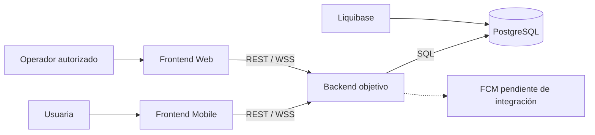
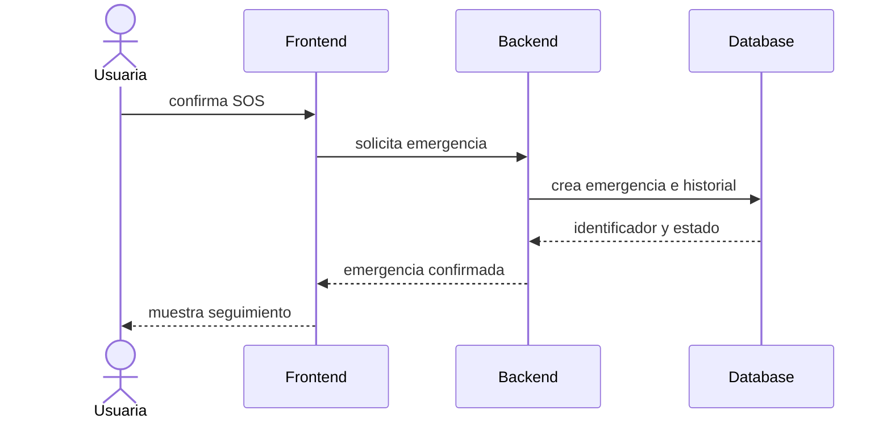
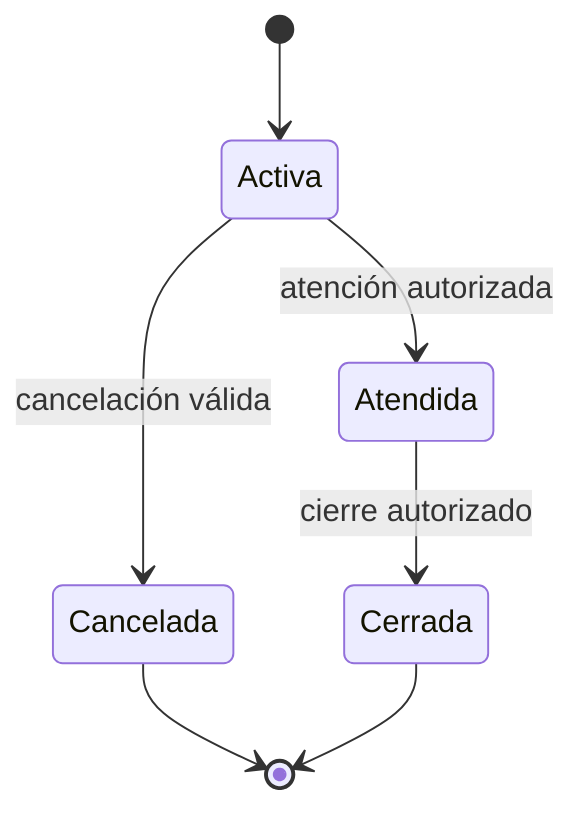
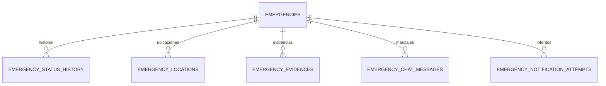

# 08 — Índice de diagramas

> [!NOTE] INSTRUCTIONS
> Actualice una vista solo junto con su documento propietario. Estado Backend: arquitectura objetivo sin implementación verificada.

## Contexto del sistema

Fuente: [arquitectura](../05-architecture/README.md).

## Inicio SOS objetivo

Fuente: [flujo funcional](../03-product/functional-flow.md). Idempotencia: **Pendiente**.

## Estados de emergencia

Los nombres definitivos se verifican en Database antes de implementar Backend.

## Agregado de emergencia

Fuente: [modelo de datos](../06-data/models.md).

## Reglas de mantenimiento

- Una vista por pregunta, sin duplicar catálogos completos.
- Etiquetar explícitamente lo objetivo o pendiente.
- Enlazar desde el índice de la sección.
- Revisar después de cada ADR o cambio de contrato relacionado.

---

**Relacionados:** [`../02-domain/domain-map.md`](../02-domain/domain-map.md) · [`../07-api/README.md`](../07-api/README.md)
