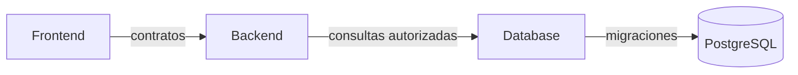

# 09 — Módulos y ecosistemas

> [!NOTE] INSTRUCTIONS
> “Módulo” representa aquí una unidad con propietario: ecosistema oficial o capacidad interna Backend. No mezcle ambos niveles.

## Propósito

Asignar responsabilidades, entradas, salidas, datos, decisiones y operación sin repetir arquitectura ni requisitos.

## Documentos

| Documento | Uso |
|---|---|
| [`module-catalog.md`](module-catalog.md) | catálogo de ecosistemas y capacidades |
| [`frontend/README.md`](frontend/README.md) | ficha del ecosistema Frontend |
| [`backend/README.md`](backend/README.md) | ficha del ecosistema Backend |
| [`database/README.md`](database/README.md) | ficha del ecosistema Database |
| [`_template-module/README.md`](_template-module/README.md) | crear una ficha nueva |

Cada carpeta usa cuatro documentos: identidad, datos, decisiones y runbook. La plantilla se copia completa y luego se reemplazan marcadores.

## Regla de propiedad

## Fuera de alcance

- Código duplicado de los repositorios.
- Catálogos funcionales repetidos.
- Presentar capacidades Backend objetivo como implementadas.
- Asignar SQL o Liquibase a Frontend o Backend.

## Listo cuando

- Cada responsabilidad tiene un único propietario.
- Las dependencias cruzan contratos definidos.
- Datos y operación enlazan sus fuentes.
- Decisiones pendientes permanecen visibles.

---

**Relacionados:** [`../02-domain/module-boundaries.md`](../02-domain/module-boundaries.md) · [`../05-architecture/module-structure.md`](../05-architecture/module-structure.md)
