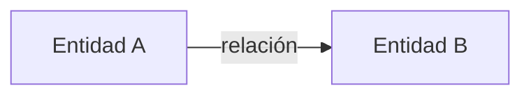

# [Ecosistema o módulo] — Modelo de datos

> [!NOTE] INSTRUCTIONS
> Describa propiedad y uso; enlace el modelo físico. No copie DDL ni esquemas completos.

## Propiedad

[Qué estado posee y cuál solo consume.]

## Entidades

| Entidad o estado | Propósito | Fuente |
|---|---|---|
| [nombre] | [responsabilidad] | [ruta] |

## Relaciones

## Reglas de integridad

- [Regla confirmada.]
- [Regla confirmada.]

## Lecturas y escrituras

| Operación | Actor | Autorización |
|---|---|---|
| [lectura/escritura] | [actor] | [regla] |

## Datos sensibles

| Dato | Riesgo | Control |
|---|---|---|
| [dato] | [riesgo] | [control o Pendiente] |

## Pendientes

- [Definición todavía necesaria.]

---

**Relacionados:** [`README.md`](README.md) · [`../../06-data/README.md`](../../06-data/README.md)
