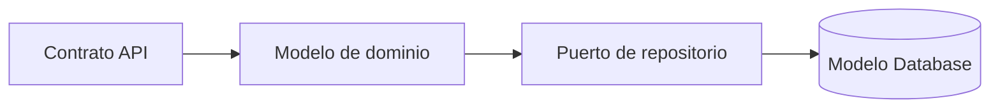

# Backend — Modelo de datos

> [!NOTE] INSTRUCTIONS
> Estado: Pendiente. Backend consume el modelo Database; no es propietario del DDL.

## Propiedad

Backend será propietario de modelos de dominio y DTO, mientras Database gobierna el modelo físico.

## Agregados objetivo

| Agregado | Responsabilidad | Fuente persistente |
|---|---|---|
| Identity | cuenta, sesión y acceso | `identity.*` |
| Profile | perfil y configuración SOS | `profile.*` |
| Emergency | ciclo, ubicación, evidencia y chat | `emergency.*` |
| Notification | dispositivos e intentos | `notification.*` |
| Audit | registro transversal autorizado | `audit.*` |

## Relaciones

## Reglas de integridad

- Validar reglas de aplicación antes de escribir.
- Confiar en constraints Database como defensa persistente.
- No exponer entidades físicas directamente en contratos.

## Datos sensibles

| Dato | Riesgo | Control |
|---|---|---|
| credenciales/OTP | acceso indebido | hash, expiración y no logging |
| ubicación/evidencia | daño a la usuaria | autorización y auditoría |

## Pendientes

- Mapeos concretos, repositorios y transacciones: **Pendiente**.
- Estrategia de borrado y retención: **En refinamiento**.

---

**Relacionados:** [`README.md`](README.md) · [`../../06-data/models.md`](../../06-data/models.md)
