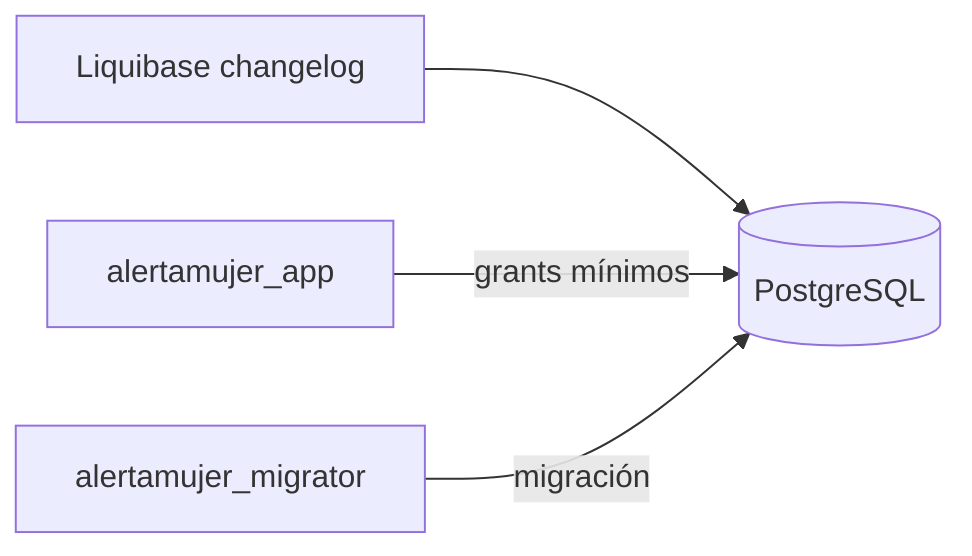

# Database — Modelo de datos

> [!NOTE] INSTRUCTIONS
> Este documento enlaza la fuente central. No replique aquí columnas o DDL.

## Propiedad

Database posee el modelo físico PostgreSQL y su evolución; Backend consume acceso autorizado.

## Agrupación

| Esquema | Capacidad | Fuente |
|---|---|---|
| `configuration` | catálogos | modelo central |
| `identity` | identidad y sesiones | modelo central |
| `profile` | perfil y configuración | modelo central |
| `contacts` | contactos | modelo central |
| `emergency` | SOS y elementos asociados | modelo central |
| `notification` | dispositivos e intentos | modelo central |
| `audit` | trazabilidad | modelo central |

## Relaciones

## Reglas de integridad

- UUID como identificador persistente donde está implementado.
- Constraints y claves foráneas nombradas.
- Privilegios concedidos por necesidad.

## Datos sensibles

| Dato | Riesgo | Control |
|---|---|---|
| hash de sesión | reutilización | funciones protegidas implementadas |
| ubicación/evidencia | exposición | acceso mínimo; retención pendiente |

## Pendientes

- Aprobar retención y clasificación por columna.

---

**Relacionados:** [`README.md`](README.md) · [`../../06-data/models.md`](../../06-data/models.md)
