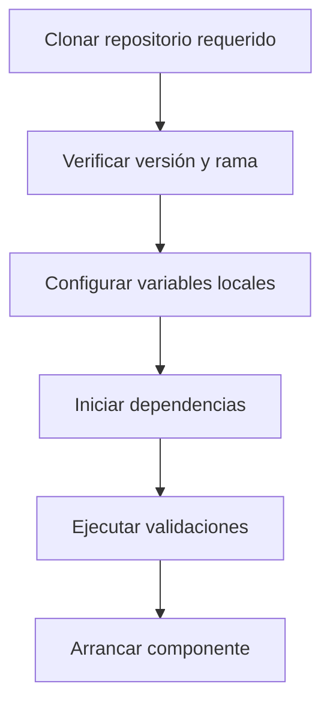

# 10 — Preparación local

> [!NOTE] INSTRUCTIONS
> Confirme versiones y scripts en cada repositorio. Los comandos genéricos no sustituyen sus README.

## Checkouts

| Ecosistema | Repositorio oficial | Fuente operativa |
|---|---|---|
| Frontend | `AlertaMujer_Frontend` | `package.json`, lockfile y README |
| Backend | `AlertaMujer_Backend` | README; implementación Pendiente |
| Database | `AlertaMujer_Database` | Compose, Liquibase y scripts |

## Orden recomendado

## Configuración

- Copiar únicamente archivos de ejemplo existentes.
- Mantener credenciales fuera de Git y documentación.
- Usar nombres y puertos vigentes del repositorio.
- No asumir que mocks Frontend equivalen a Backend disponible.

## Database

La validación automatizada usa Docker Compose, PostgreSQL, Liquibase y un ambiente desechable. El puerto documentado del contenedor PostgreSQL es `5433`; confirme el mapeo local antes de conectar.

## Backend

Comando de build, perfil y health check: **Pendiente**, porque no existe aplicación funcional verificada.

## Frontend

Ejecute los scripts declarados en el `package.json` correspondiente. Valide Mobile y Web por separado y preserve evidencia del comando exacto.

## Cierre

El setup está listo cuando las validaciones del ecosistema pasan sin modificar repositorios ajenos.

---

**Relacionados:** [`../09-modules/README.md`](../09-modules/README.md) · [`./environments.md`](./environments.md)
