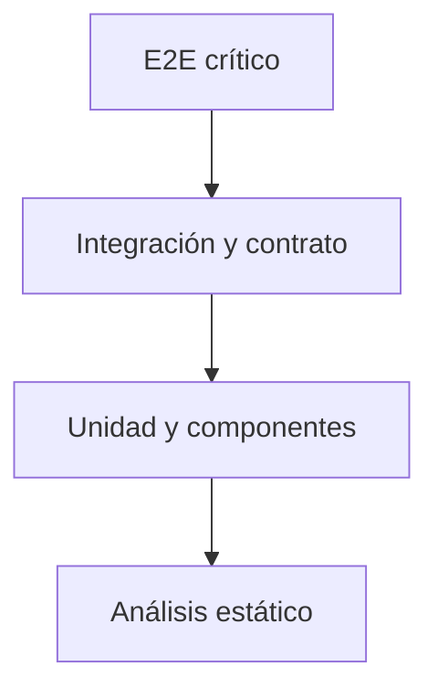

# 11 — Calidad

> [!NOTE] INSTRUCTIONS
> La evidencia debe corresponder al cambio y terminar de forma concluyente. No use una ejecución parcial como aprobación.

## Propósito

Definir estrategia de prueba, disciplina de desarrollo y formato reproducible de casos.

## Documentos

| Documento | Uso |
|---|---|
| [`testing-strategy.md`](testing-strategy.md) | niveles, gates y evidencia |
| [`tdd-guide.md`](tdd-guide.md) | ciclo de desarrollo guiado por pruebas |
| [`_template-test-case.md`](_template-test-case.md) | caso manual o automatizado trazable |

## Pirámide adaptada

## Fuera de alcance

- Inventar porcentajes de cobertura.
- Aprobar cambios sin resultado final.
- Duplicar suites en documentación.
- Sustituir revisión de seguridad con pruebas felices.

## Listo cuando

- Cada riesgo tiene nivel de prueba adecuado.
- La evidencia incluye comando, ambiente y resultado.
- Flujos críticos cubren errores y autorización.
- Casos enlazan requisito, cambio y evidencia.

---

**Relacionados:** [`../04-requirements/traceability-matrix.md`](../04-requirements/traceability-matrix.md) · [`../00-governance/definition-of-done.md`](../00-governance/definition-of-done.md)
