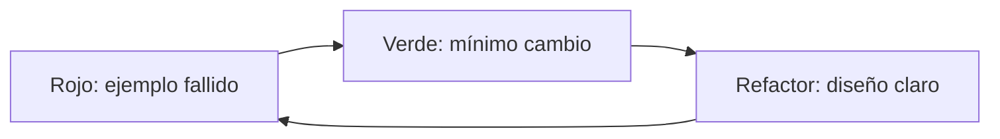

# 11 — Guía TDD

> [!NOTE] INSTRUCTIONS
> Aplique TDD cuando el comportamiento sea especificable. No escriba pruebas para consolidar una decisión todavía pendiente.

## Ciclo

## Antes de empezar

- Requisito e historia están listos.
- El comportamiento observable y el propietario están claros.
- Dependencias externas tienen contrato o doble controlado.
- Los datos y permisos del escenario están definidos.

## Por ecosistema

| Ecosistema | Unidad preferida | Límite a no simular |
|---|---|---|
| Frontend | componente, hook o servicio | experiencia crítica completa |
| Backend | regla de dominio o caso de uso | contrato y persistencia real |
| Database | changeSet y constraint | motor PostgreSQL real |

## Calidad del test

- Nombre describe condición y resultado.
- Un motivo principal de fallo.
- Datos mínimos y legibles.
- Determinista y aislado.
- Refactor no altera el comportamiento cubierto.

## Excepciones

Exploración, documentación o infraestructura pueden requerir otro enfoque; la PR explica el motivo y preserva validación proporcional.

## Cierre

El ciclo termina cuando pruebas nuevas y existentes pasan, se elimina duplicación y la evidencia enlaza la historia.

---

**Relacionados:** [`./testing-strategy.md`](./testing-strategy.md) · [`../00-governance/definition-of-ready.md`](../00-governance/definition-of-ready.md)
