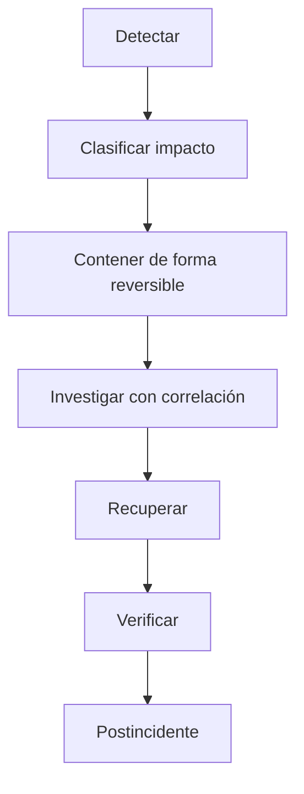

# 13 — Runbook global

> [!NOTE] INSTRUCTIONS
> Estado: En refinamiento. Use los runbooks específicos y no ejecute una acción irreversible sin objetivo, respaldo y autorización.

## Clasificación inicial

| Pregunta | Evidencia |
|---|---|
| ¿Qué falla? | superficie, operación y síntoma |
| ¿Desde cuándo? | primer evento y despliegue cercano |
| ¿A quién afecta? | alcance sin datos personales |
| ¿Qué cambió? | commit, release o configuración |

## Flujo

## Derivación

| Síntoma | Runbook propietario |
|---|---|
| Mobile/Web | [`../09-modules/frontend/runbook.md`](../09-modules/frontend/runbook.md) |
| API/servicios | [`../09-modules/backend/runbook.md`](../09-modules/backend/runbook.md) |
| migración/PostgreSQL | [`../09-modules/database/runbook.md`](../09-modules/database/runbook.md) |

## Contención

Priorizar acciones reversibles, reducir alcance y preservar evidencia. No borrar datos ni reiniciar componentes por ensayo.

## Comunicación

Canales, severidades, responsables y tiempos: **Pendiente**. El registro debe separar hechos, hipótesis y decisiones.

## Cierre

Servicio verificado, impacto conocido, evidencia preservada, acciones de seguimiento con dueño y documento actualizado.

---

**Relacionados:** [`./_template-incident.md`](./_template-incident.md) · [`./observability.md`](./observability.md)
