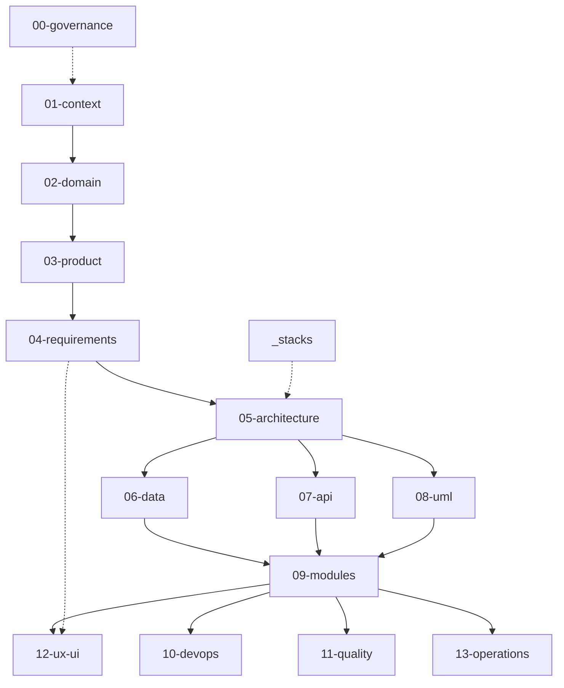

# AlertaMujer — Documentación Técnica Oficial

> Repositorio central de diseño, requisitos, arquitectura, desarrollo y operación de **AlertaMujer**.

## Alcance

- Un sistema distribuido en tres repositorios independientes: Frontend, Backend y Database.
- Una aplicación Mobile Android, una Web pública y un panel administrativo dentro de Frontend.
- Un Backend Java/Spring Boot con scaffold integrado; sus módulos funcionales continúan pendientes de implementación.
- Una base PostgreSQL gobernada exclusivamente mediante Liquibase desde Database.
- Contratos REST y WSS/STOMP que coordinan clientes y servidor.
- Documentación guiada por Software Design Documentation, trazabilidad y evidencia verificable.

## Fuera de alcance

- Presentar diseño aprobado como código implementado.
- Duplicar migraciones, código o configuración que pertenecen a los repositorios técnicos.
- Añadir microservicios, colas, almacenamiento de evidencias en nube o CI/CD sin decisión aprobada.
- Inventar ambientes, métricas, requisitos, reglas o integraciones para completar documentos.
- Tratar una rama Git como ambiente desplegado sin evidencia operativa.

## Cómo usar este repositorio

1. Lea [`00-sdd-guide.md`](./00-sdd-guide.md) para conocer fases, puertas y orden.
2. Aplique primero [`00-governance/`](./00-governance/README.md).
3. Recorra contexto, dominio, producto, requisitos y arquitectura en orden numérico.
4. Consulte datos, API, UML y módulos antes de implementar un cambio.
5. Use las plantillas ubicadas dentro del dominio que gobierna cada artefacto.
6. Actualice documentación y evidencia en el mismo Pull Request del cambio técnico.
7. Ejecute `scripts/validate-docs.ps1` antes de solicitar revisión.

## Dependencias entre secciones

La flecha continua indica dependencia de definición. La flecha punteada indica una regla transversal o una fuente que informa sin bloquear.

## Las quince secciones

| Sección | Pregunta que responde |
|---|---|
| [`00-governance/`](./00-governance/README.md) | ¿Cómo se planifica, documenta, revisa, integra y protege el trabajo? |
| [`01-context/`](./01-context/README.md) | ¿Por qué existe el sistema, para quién y dónde están sus límites? |
| [`02-domain/`](./02-domain/README.md) | ¿Cuáles son los dominios, entidades, reglas y límites funcionales? |
| [`03-product/`](./03-product/README.md) | ¿Qué problema se resuelve y hacia dónde evoluciona el producto? |
| [`04-requirements/`](./04-requirements/README.md) | ¿Qué debe hacer el sistema y cómo se verifica? |
| [`05-architecture/`](./05-architecture/README.md) | ¿Qué forma técnica adopta y cómo se protegen sus límites? |
| [`06-data/`](./06-data/README.md) | ¿Qué se persiste, quién lo posee y cómo cambia el esquema? |
| [`07-api/`](./07-api/README.md) | ¿Qué contratos consumen Mobile y Web? |
| [`08-uml/`](./08-uml/README.md) | ¿Cómo se visualizan estructuras, estados y flujos críticos? |
| [`09-modules/`](./09-modules/README.md) | ¿Qué posee y expone cada ecosistema o módulo? |
| [`10-devops/`](./10-devops/README.md) | ¿Cómo se prepara, valida y promueve cada artefacto? |
| [`11-quality/`](./11-quality/README.md) | ¿Qué se prueba, en qué capa y con qué evidencia? |
| [`12-ux-ui/`](./12-ux-ui/README.md) | ¿Qué mantiene coherentes las interfaces? |
| [`13-operations/`](./13-operations/README.md) | ¿Cómo se observa, recupera y documenta una falla? |
| [`_stacks/`](./_stacks/README.md) | ¿Cómo se materializan estas reglas en cada tecnología? |

## Ecosistemas oficiales

| Ecosistema | Responsabilidad | Repositorio |
|---|---|---|
| Frontend | Mobile, Web pública y panel administrativo | [AlertaMujer_Frontend](https://github.com/FreinierCardona/AlertaMujer_Frontend) |
| Backend | API, seguridad, reglas transaccionales e integraciones servidor | [AlertaMujer_Backend](https://github.com/FreinierCardona/AlertaMujer_Backend) |
| Database | PostgreSQL, roles técnicos y migraciones Liquibase | [AlertaMujer_Database](https://github.com/FreinierCardona/AlertaMujer_Database) |

## Estado documental

El bloque `INSTRUCTIONS` permanece hasta que una segunda persona revise el documento. `Pendiente` significa que no existe definición; `En refinamiento`, que existe una base incompleta; `Vigente`, que el contenido está confirmado aunque todavía pueda requerir revisión editorial.

## Contribución

Consulte [CONTRIBUTING.md](CONTRIBUTING.md).

## Licencia

Estado: Pendiente. Consulte [LICENSE](LICENSE) antes de reutilizar o distribuir esta documentación.
